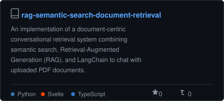
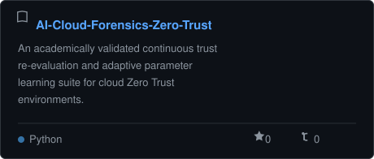
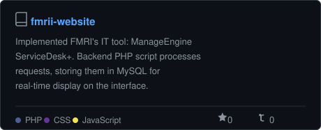
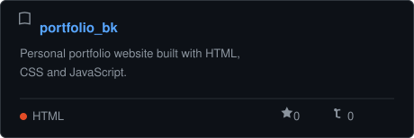
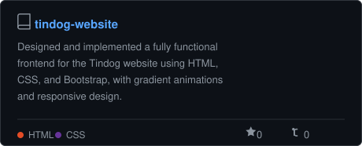
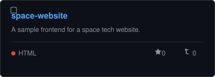

# Hi, I'm Bansheen Kaur

### Computer Science Engineer • AI Researcher • Software Developer

Building intelligent software systems through Artificial Intelligence, Cybersecurity, Cloud Computing, and applied research.

<a href="https://scholar.google.com/citations?hl=en&user=aLKNx3kAAAAJ">Google Scholar</a> •
<a href="https://www.linkedin.com/in/bansheen-kaur-a8120b227">LinkedIn</a> •
<a href="https://kbansheen.github.io/portfolio_bk/">Portfolio</a> •
<a href="mailto:banshofficial123@gmail.com">Email</a>

---

## About Me

I enjoy building intelligent software that combines research with practical engineering. My interests span Artificial Intelligence, Cybersecurity, Cloud Computing, Software Engineering, and Intelligent Information Retrieval, where I focus on developing solutions that are both technically rigorous and applicable to real-world challenges.

As a Computer Science Engineer, I enjoy designing and developing software that solves practical problems while exploring emerging technologies. My work ranges from AI-powered information retrieval systems and intelligent security solutions to full-stack web applications, cloud-based systems, and software engineering projects.

Alongside software development, I actively work on AI-driven approaches for secure systems, Retrieval-Augmented Generation (RAG), semantic search, trustworthy AI, and intelligent cybersecurity. I believe research creates the greatest impact when it evolves into reproducible implementations that others can understand, build upon, and apply.

---

## Research

My work explores how Artificial Intelligence can enhance cybersecurity, cloud security, and intelligent information systems.

Rather than treating research as a finished publication, I view it as a continuous engineering process—starting with identifying a problem, progressing through experimentation and implementation, and evolving through ongoing improvements and future research.

### Research Interests

- Artificial Intelligence
- Cybersecurity
- Retrieval-Augmented Generation (RAG)
- Semantic Search
- Zero Trust Security
- Cloud Security
- Cloud Forensics
- Intelligent Incident Response
- Large Language Models
- Trustworthy AI

> *"Good research doesn't end with publication—it continues through implementation, validation, and continuous improvement."*

---

## Featured Work

The projects below represent my work across Artificial Intelligence, Cybersecurity, Cloud Computing, and Software Engineering. They combine research with practical implementations, focusing on building intelligent, secure, and scalable systems.

### 1. RAG Semantic Search Platform

A research-driven implementation that enhances document retrieval using semantic search and Large Language Models through Retrieval-Augmented Generation (RAG).

**Highlights**

- Intelligent document retrieval
- Semantic search pipeline
- Context-aware information retrieval
- Built alongside my published research

[Research Paper](https://pubs.aip.org/aip/acp/article-abstract/3426/1/020016/3393206/Retrieval-augmented-generation-with-semantic) •
[Documentation](https://github.com/Kbansheen/rag-semantic-search-document-retrieval/blob/main/README.md) •
[Implementation](https://github.com/Kbansheen/rag-semantic-search-document-retrieval)

---

### 2. AI Cloud Security Framework

An ongoing implementation exploring AI-assisted cloud forensics, adaptive trust evaluation, and intelligent incident response for secure cloud environments.

**Highlights**

- AI-assisted cloud investigations
- Behaviour-based trust evaluation
- Zero Trust security principles
- Intelligent incident response

[Research Paper](https://ieeexplore.ieee.org/document/11386291) •
[Implementation](https://github.com/Kbansheen/AI-Cloud-Forensics-Zero-Trust)

---

### 3. FMRI IT Service Portal

A web application developed to manage internal IT service requests with a structured backend and database-driven workflow.

**Highlights**

- Service request management
- Database integration
- Internal workflow automation
- PHP & MySQL backend

---

### 4. Frontend & Web Projects

A collection of responsive web applications built to explore modern frontend development, UI design, and web engineering.

**Highlights**

- Responsive web interfaces
- Modern frontend development
- Interactive UI components
- Clean and scalable design

<table>
  <tr>
    <td></td>
    <td></td>
    <td></td>
  </tr>
</table>

---

<a href="https://github.com/kbansheen?tab=repositories">
<b>View All Repositories →</b>
</a>

---

## Publications & Research

Research, for me, is more than publishing papers—it's about transforming ideas into practical, reproducible implementations. Every project I work on aims to bridge the gap between theory and real-world engineering, allowing others to understand, reproduce, and build upon the work.

### 1. Retrieval-Augmented Generation with Semantic Search

**Status:** Published

A research study exploring how semantic search and Retrieval-Augmented Generation (RAG) can improve document retrieval using Large Language Models for intelligent knowledge retrieval.

**Links**

- 📄 [**View Publication**](https://pubs.aip.org/aip/acp/article-abstract/3426/1/020016/3393206/Retrieval-augmented-generation-with-semantic)
- 💻 [**View Implementation**](https://github.com/Kbansheen/rag-semantic-search-document-retrieval)
- 📘 [**Project Documentation**](https://github.com/Kbansheen/rag-semantic-search-document-retrieval/blob/main/README.md)

---

### 2. Integrating AI and Zero Trust in Cloud Forensics & Incident Response

**Status:** Published

A comprehensive review exploring how Artificial Intelligence and Zero Trust principles can be combined for cloud forensics and intelligent incident response in secure cloud environments.

**Overview**

This review examines how security frameworks can move beyond traditional perimeter-based defence toward a continuous, AI-assisted approach for cloud environments. It studies the integration of Zero Trust fundamentals—continuous verification, least-privilege access, micro-segmentation—with AI-driven detection, analytics, and automated response.

**Key Areas Covered**

- Zero Trust architecture principles applied to cloud and cloud-native environments
- AI-assisted cloud forensics and evidence collection
- Behavioural analytics for trust evaluation and anomaly detection
- Intelligent and automated incident response workflows
- Challenges and future directions in integrating AI with Zero Trust

**Links**

- 📄 [**View Publication**](https://ieeexplore.ieee.org/document/11386291)
- 💻 [**View Implementation**](https://github.com/Kbansheen/AI-Cloud-Forensics-Zero-Trust)

**Ongoing Work**

I continue to build on this published review with an actual implementation exploring adaptive trust evaluation, AI-assisted cloud forensics, and intelligent incident response. New findings, code, and repositories will be added as this research progresses.

---

### 3. Role of Nanomaterials in Li-Fi

**Status:** Published

A review study exploring how nanomaterials can enhance Li-Fi communication systems and their future potential in next-generation wireless communication.

**Links**

- 📄 **View Publication** *(Add publication URL)*

---

## Technical Expertise

My technical background combines software engineering, artificial intelligence, cybersecurity, cloud technologies, and research-driven development. I enjoy building systems that are practical, scalable, and supported by sound engineering principles.

| Domain | Technologies |
|---------|--------------|
| **Programming Languages** | Java • Python • C/C++ • JavaScript • PHP • SQL |
| **Artificial Intelligence** | LangChain • Retrieval-Augmented Generation (RAG) • Semantic Search • LLM Integration • Prompt Engineering |
| **Cybersecurity** | Zero Trust Security • Cloud Security • Cloud Forensics • Incident Response • Behavioural Analytics |
| **Software Development** | Object-Oriented Programming • REST APIs • Software Design • Full-Stack Development |
| **Web Technologies** | HTML • CSS • Bootstrap • React • PHP |
| **Cloud Technologies** | AWS • Cloud Computing |
| **Databases** | MySQL |
| **Tools & Platforms** | Git • GitHub • Qlik Sense • UiPath Studio |

---

## Let's Connect

Whether you'd like to discuss research, collaborate on software projects, exchange ideas around Artificial Intelligence, Cybersecurity, Cloud Computing, or simply connect with a fellow developer, I'd be happy to hear from you.

---

*"Building intelligent software through research, engineering, and continuous learning."*

⭐ If you find my work interesting, feel free to explore my repositories or connect with me.

